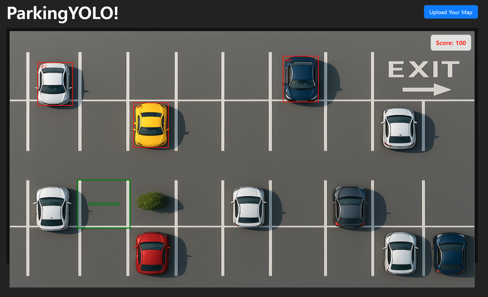
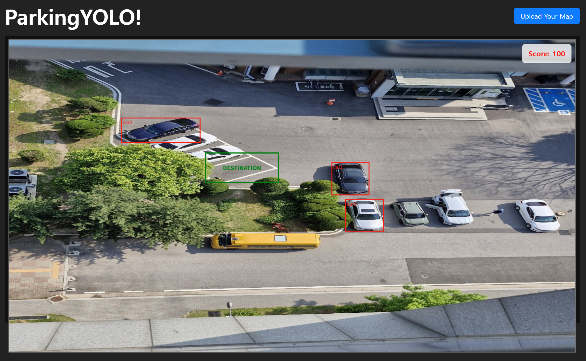
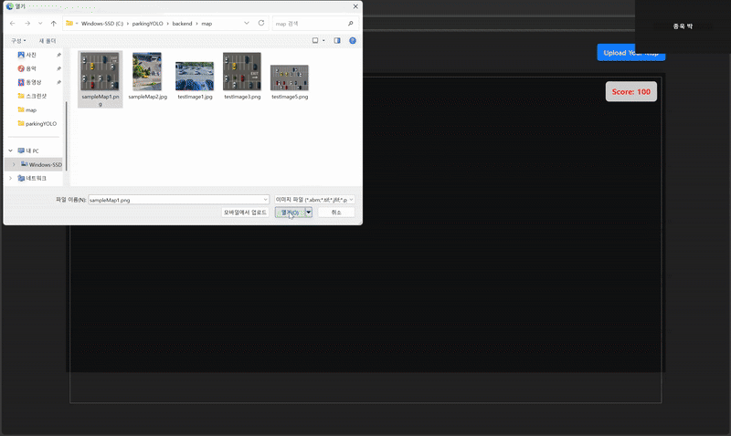
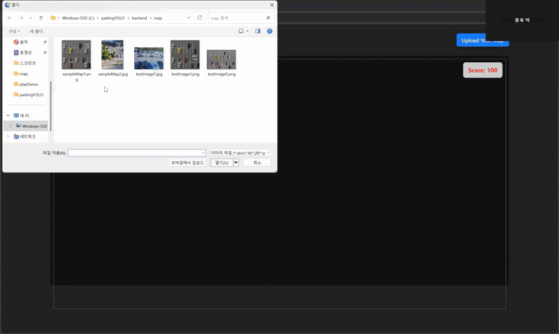

# ParkingYOLO
A game where you control and park a car detected by YOLO in the uploaded map image

# 주요기능
맵으로 사용하고 싶은 top view 주차장 이미지 업로드

2개의 YOLO 모델 사용
- carSeg : 차량을 감지, 사용자 캐릭터로 선택 가능
- parkingLot : 주차장 공간을 감지(이미 주차되어 있는 공간occupied, 빈 공간vacant)

신뢰도 기준으로 car 3대, destination(vacant) 1곳 표시

YOLO가 detect한 이미 주차되어 있는 공간occupied, 선택되지 않은 차량에 충돌 시 감점

선택한 차량을 조종해 destination에 도달하면 종료, 최종 점수 표시

# 맵으로 사용할 이미지

top view의 주차장 이미지

cartoon style, 실제 촬영한 이미지 모두 가능(sampleMap1,2)

# 조작법

mouse click으로 빨간 박스로 표시된 차량 중 하나 선택

keyboard 방향키 사용해서 조종

up, down : 전진, 후진

left, right : 회전

# Gameplay Demo

# 동작 설명

car 단일 class의 yolo1, occupied, vacant 2개 class의 yolo2 학습

사용자가 Upload Your Map버튼을 눌러 맵으로 사용할 이미지 upload

flask 서버의 YOLOv8 모델이 업로드한 이미지에서 object detection 수행

탐지한 object, 신뢰도, angle을 저장해 frontend에서 사용

- model1 : car segmentation 단일 class 탐지 신뢰도 기준 상위 3개의 차량으로 플레이 가능, 빨간 박스로 표시 나머지는 충돌 시 감점되는 장애물로 사용

- model2 : occupied, vacant 2개 class 탐지 occupied는 모두 충돌 시 감점되는 장애물로 사용, 1개의 vacant는 destination, 초록 박스로 표시

업로드하는 이미지의 크기는 각각 다를 수 있기에 캔버스 크기 비율에 맞춰서 다시 그림

- YOLO가 이미지에서 detection한 실제 좌표와 사용자가 보게 될 반응형 canvas 좌표 통일

- 마우스 클릭 좌표가 canvas내의 같은 위치를 가리키도록 보정

carController, useEffect로 맵에서 캐릭터의 이동, 회전하는 움직임 업데이트, 시각화

빨간 박스로 표시된 차량 중 하나를 클릭하면 해당 차량 부분을 잘라와 조작 가능한 캐릭터로 사용, 원래 차량이 존재하던 위치는 starting point로 지정, 표시

starting point와 자기 자신은 충돌 시 감점되는 충돌 박스에서 제외

조작 중인 차량이 장애물에 닿으면 Score 감소

destination box에 캐릭터가 도달하면 게임 종료, 최종 Score 표시, 캐릭터는 조작 불가 처리

새로운 이미지를 업로드하면 초기화, 다른 맵에서 플레이 가능

# 개선점 및 발전 방향

top view가 아닌 이미지의 경우 사용하기 어려움 (getPerspectiveTransform, warpPerspective 사용 고려)

car만 정확히 자르지 못할 경우(ex : 대각으로 주차된 차량) 캐릭터의 움직임이 부자연스러움

이미지 내에 YOLO가 detect하지 않은 장애물은 충돌 처리 불가

# Reference

Roboflow dataset parking space 3,4 by parkinglotdetectionteamcentaurus, Car_segmentation by vince0404

Ultralytics YOLOv8
